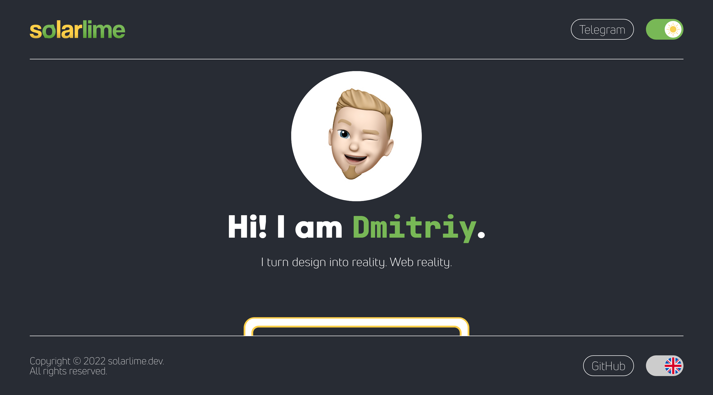

# Homepage

## What:

This is a repository for [my homepage](https://solarlime.dev). This branch contains a stable version of the project.

## Why:

I think that each front-end developer should have some kind of self-introduction. The best way is to show skills on a personal website. The first version was built with Create React App in 2022 and had some features:

- Responsive design
- Safari 12 and newer browsers support
- Theme switcher
- Language switcher (both provided by React Context API)
- Optimised images
- CV print version
- 404 page with random images from Unsplash

  
How it looked like:

However, it had some issues:

- Nested structure of pages: main --> projects --> project. The further the project, the more complicated (and buggy) it became.
- Giant header & footer - little space left for the content. And other design issues.
- Create React App had security issues and now is not maintained.
- Hard to test: content used closures to cache

## What is now

- Existing features are still there
- Uses Vite & TypeScript
- Has simpler design & structure
- Rendered with React
- Routed with React Router
- State is controlled with Redux (RTK)
- Content is fetched with RTK Query & Thunks
- Content can be fetched from 2 sources (Vercel Blob — as a fallback)
- CV can be downloaded
- Tested with Testing Library & MSW
- And other smaller features

#### You are welcome to [visit](https://solarlime.dev)! 😉
